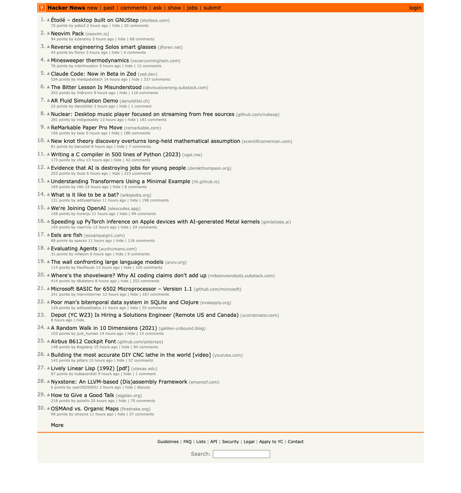

# Gemini-cli
  
  The screenshot is saved at /Users/tam0123/code/gemini/.playwright-mcp/hackernews.png.

  Here are the top 4 posts on Hacker News by points:

```
  ┌──────┬──────────────────────────────────────────────────────────────────────┬────────────────────────────────────────────────────────────────────────────┬────────┐
  │ Rank │ Title                                                                │ URL                                                                        │ Points │
  ├──────┼──────────────────────────────────────────────────────────────────────┼────────────────────────────────────────────────────────────────────────────┼────────┤
  │ 1    │ Claude Code: Now in Beta in Zed                                      │ https://zed.dev/blog/claude-code-via-acp                                   │ 534    │
  │ 2    │ Where's the shovelware? Why AI coding claims don't add up            │ https://mikelovesrobots.substack.com/p/wheres-the-shovelware-why-ai-coding │ 414    │
  │ 3    │ Nuclear: Desktop music player focused on streaming from free sources │ https://github.com/nukeop/nuclear                                          │ 291    │
  │ 4    │ Evidence that AI is destroying jobs for young people                 │ https://www.derekthompson.org/p/the-evidence-that-ai-is-destroying         │ 253    │
  └──────┴──────────────────────────────────────────────────────────────────────┴────────────────────────────────────────────────────────────────────────────┴────────┘
```

